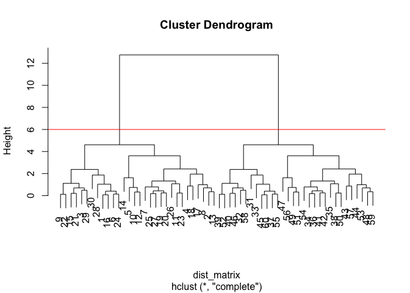
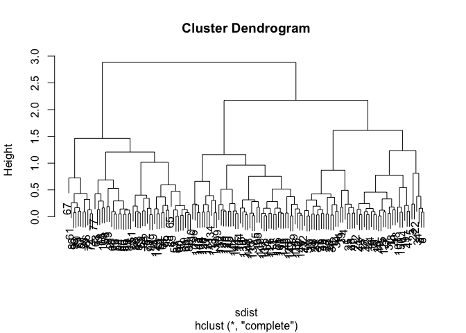
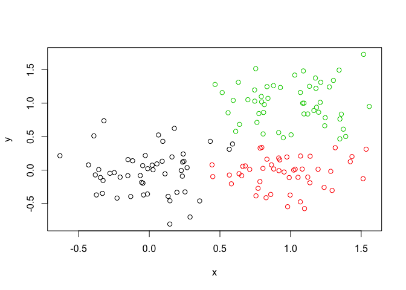

Class08
================
STEPHANIE CURTIS
2/6/2019

R Markdown
----------

This is an R Markdown document. Markdown is a simple formatting syntax for authoring HTML, PDF, and MS Word documents. For more details on using R Markdown see <http://rmarkdown.rstudio.com>.

When you click the **Knit** button a document will be generated that includes both content as well as the output of any embedded R code chunks within the document. You can embed an R code chunk like this:

``` r
# Generate some example data for clustering
tmp <- c(rnorm(30,-3), rnorm(30,3))
x <- cbind(x=tmp, y=rev(tmp))
plot(x)
```


``` r
km<-kmeans(x,centers=2,nstart=20)
km
```

    ## K-means clustering with 2 clusters of sizes 30, 30
    ## 
    ## Cluster means:
    ##           x         y
    ## 1 -3.126108  3.252343
    ## 2  3.252343 -3.126108
    ## 
    ## Clustering vector:
    ##  [1] 1 1 1 1 1 1 1 1 1 1 1 1 1 1 1 1 1 1 1 1 1 1 1 1 1 1 1 1 1 1 2 2 2 2 2
    ## [36] 2 2 2 2 2 2 2 2 2 2 2 2 2 2 2 2 2 2 2 2 2 2 2 2 2
    ## 
    ## Within cluster sum of squares by cluster:
    ## [1] 62.01692 62.01692
    ##  (between_SS / total_SS =  90.8 %)
    ## 
    ## Available components:
    ## 
    ## [1] "cluster"      "centers"      "totss"        "withinss"    
    ## [5] "tot.withinss" "betweenss"    "size"         "iter"        
    ## [9] "ifault"

``` r
#size of clusters
km$size
```

    ## [1] 30 30

``` r
km$cluster
```

    ##  [1] 1 1 1 1 1 1 1 1 1 1 1 1 1 1 1 1 1 1 1 1 1 1 1 1 1 1 1 1 1 1 2 2 2 2 2
    ## [36] 2 2 2 2 2 2 2 2 2 2 2 2 2 2 2 2 2 2 2 2 2 2 2 2 2

``` r
plot(x,col=km$cluster)
points(km$centers,col="blue",pch=15,cex=1.5)
```


HIERARCHICAL CLUSTERING
-----------------------

``` r
#Hierarchical clustering in R
# First we need to calculate point (dis)similarity
# as the Euclidean distance between observations
dist_matrix <- dist(x)
# The hclust() function returns a hierarchical
# clustering model
hc <- hclust(d = dist_matrix)
# the print
hc
```

    ## 
    ## Call:
    ## hclust(d = dist_matrix)
    ## 
    ## Cluster method   : complete 
    ## Distance         : euclidean 
    ## Number of objects: 60

``` r
plot(hc)
abline(h=6,col="red")
```



``` r
#cut your tree of variable hc by h height OR BY K=Number if you know how many groups you want but don't know what height to cut at to get the two groups. We picked 6 because we looked at the plot and knew it was at that height..
grp2<-cutree(hc,h=6)
```

``` r
plot(x,col=grp2)
```


``` r
plot(hc)
abline(h=2.5,col="blue")
```


``` r
groupsies<-cutree(hc,h=2.5)
plot(x,col=groupsies)
```


Different linkage methods for clustering
----------------------------------------

Default is Complete which does pairwase comparisons for each point and picks the farthest ones and goes from there branching out to the enxt closest one to include in the cluster. Other options include "Single" which starts with the two closest. "Average" " which somehow uses the average of the distance between two points to start or something and finally "centroid" which finds the center of each (of the two?) clusters and goes from there.

``` r
#try hc plotting whith different methods (hc.single<-hclust(x,single)) or something
```

Stephanie gives it a go all by herself:
---------------------------------------

``` r
# Step 1. Generate some example data for clustering
x <- rbind(
 matrix(rnorm(100, mean=0, sd = 0.3), ncol = 2), # c1
 matrix(rnorm(100, mean = 1, sd = 0.3), ncol = 2), # c2
 matrix(c(rnorm(50, mean = 1, sd = 0.3), # c3
 rnorm(50, mean = 0, sd = 0.3)), ncol = 2))
colnames(x) <- c("x", "y")
# Step 2. Plot the data without clustering
plot(x)
```


``` r
# Step 3. Generate colors for known clusters
# (just so we can compare to hclust results)
col <- as.factor( rep(c("c1","c2","c3"), each=50) )
plot(x, col=col)
```


``` r
sdist<-dist(x) #calc dist between points
sdchc<-hclust(sdist)
#dendrogram
plot(sdchc)
```



``` r
sgrp2<-cutree(sdchc,k=2)
plot(x,col=sgrp2)
```


``` r
sgrp3<-cutree(sdchc,k=3)
plot(x,col=sgrp3)
```

 Boundaries are the issue. The structure/core of the clustrers are pretty reproducible and trustworthy but the boundaries are not so. IF you look at the in;put graph versus the graph of 3 clustrers that I generated some things were put into the red that I know from the input actually belong to green or black etc.

NOW WE ARE DOING PCA
====================

``` r
## You can also download this file from the class website!
mydata <- read.csv("https://tinyurl.com/expression-CSV",
 row.names=1)
head(mydata) 
```

    ##        wt1 wt2  wt3  wt4 wt5 ko1 ko2 ko3 ko4 ko5
    ## gene1  439 458  408  429 420  90  88  86  90  93
    ## gene2  219 200  204  210 187 427 423 434 433 426
    ## gene3 1006 989 1030 1017 973 252 237 238 226 210
    ## gene4  783 792  829  856 760 849 856 835 885 894
    ## gene5  181 249  204  244 225 277 305 272 270 279
    ## gene6  460 502  491  491 493 612 594 577 618 638

``` r
#prcomp data actaully needs your data flipped.. hence the t for transpose
pca <- prcomp(t(mydata), scale=TRUE) 
summary(pca)
```

    ## Importance of components:
    ##                           PC1    PC2     PC3     PC4     PC5     PC6
    ## Standard deviation     9.6237 1.5198 1.05787 1.05203 0.88062 0.82545
    ## Proportion of Variance 0.9262 0.0231 0.01119 0.01107 0.00775 0.00681
    ## Cumulative Proportion  0.9262 0.9493 0.96045 0.97152 0.97928 0.98609
    ##                            PC7     PC8     PC9      PC10
    ## Standard deviation     0.80111 0.62065 0.60342 3.348e-15
    ## Proportion of Variance 0.00642 0.00385 0.00364 0.000e+00
    ## Cumulative Proportion  0.99251 0.99636 1.00000 1.000e+00

Make our first pca plot

``` r
plot(pca$x)
```


``` r
plot(pca$x[,1], pca$x[,2]) 
```


``` r
## Variance captured per PC
pca.var <- pca$sdev^2 
pca.var.per <- round(pca.var/sum(pca.var)*100, 1)
pca.var.per
```

    ##  [1] 92.6  2.3  1.1  1.1  0.8  0.7  0.6  0.4  0.4  0.0

``` r
barplot(pca.var.per, main="Scree Plot",
 xlab="Principal Component", ylab="Percent Variation")
```


``` r
#Lets make our plot a bit more useful…
## A vector of colors for wt and ko samples
colvec <- as.factor( substr( colnames(mydata), 1, 2) )
#substr cuts off your strings. ^^IN this example it is taking your column name strings of your data mydata which are wt1 wt2 wt3 wt4 wt5 ko1 ko2 ko3 ko4 and ko5 and then takes the 1st and 2nd characters of them which are wt and ko such that wt1-5 are now all wt and ko1-5 are now all ko!!! You will def want to do this
plot(pca$x[,1], pca$x[,2], col=colvec, pch=16,
 xlab=paste0("PC1 (", pca.var.per[1], "%)"),
 ylab=paste0("PC2 (", pca.var.per[2], "%)")) 
```


Hands-on section worksheet
==========================

``` r
x<- read.csv("UK_foods.csv")
#I manually uploaded thisfile bc im a n00b
```

``` r
dim(x)
```

    ## [1] 17  5

``` r
#to find the dimensions of x!
```

``` r
head(x)
```

    ##                X England Wales Scotland N.Ireland
    ## 1         Cheese     105   103      103        66
    ## 2  Carcass_meat      245   227      242       267
    ## 3    Other_meat      685   803      750       586
    ## 4           Fish     147   160      122        93
    ## 5 Fats_and_oils      193   235      184       209
    ## 6         Sugars     156   175      147       139

``` r
#because the row names were assigned to a column.. but we don't want them as a column with a column header we just want them to be row labels basically, not part of the table data!!
# Note how the minus indexing works
rownames(x) <- x[,1]#This assigns the data currently in x column 1 to be the names of the rows. 
x <- x[,-1]#Then this removes the first column! IF YOU WANT EVERYTHING EXCEPT THE FIRST COLUMN TO BE PRINTED YOU CAN USE THE MINUSSIGN. IF YOU WANTED ALL WITHOUT THE COLUMNS 1-3 you can write "-1:3" wowza
head(x)
```

    ##                England Wales Scotland N.Ireland
    ## Cheese             105   103      103        66
    ## Carcass_meat       245   227      242       267
    ## Other_meat         685   803      750       586
    ## Fish               147   160      122        93
    ## Fats_and_oils      193   235      184       209
    ## Sugars             156   175      147       139

``` r
#Moral of the story: A better way to fix this would be to read this file in correctly. read.csv("UK_foods.csv",row.names=1) which tells you that the first column is actually the row names. THe code in this chunk is dangerous bc it is coding to delete columns from your dataset! Yikes!
```

``` r
x <- read.csv("UK_foods.csv")
```
