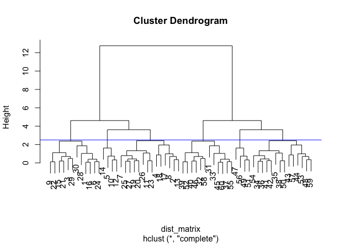
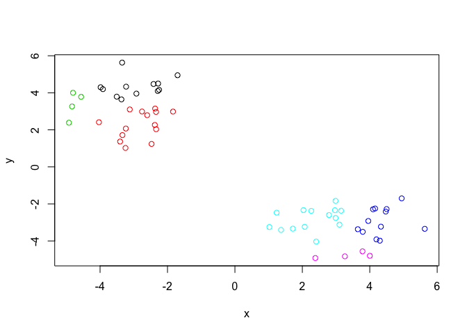
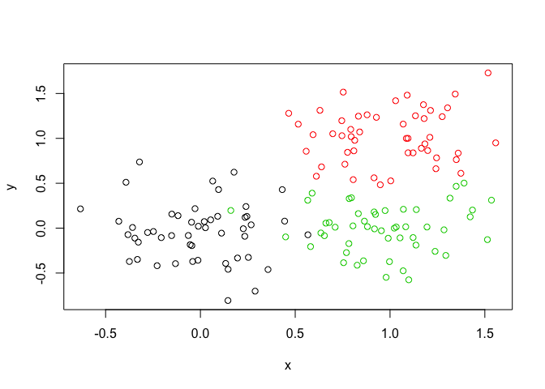
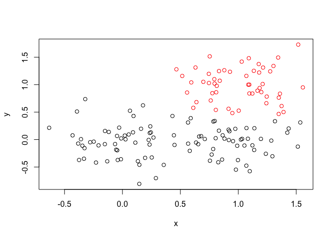

Clustering Analysis in R
================
STEPHANIE CURTIS
2/6/2019

Explore how and when to perform different clustering methods
----------

Generate example data to cluster and plot it:
``` r
tmp <- c(rnorm(30,-3), rnorm(30,3))
x <- cbind(x=tmp, y=rev(tmp))
plot(x)
```


K-means Clustering:
-----------------------
Use kmeans() function:
``` r
#specify the number of clusters:
km<-kmeans(x,centers=2,nstart=20)
km
```

    ## K-means clustering with 2 clusters of sizes 30, 30
    ## 
    ## Cluster means:
    ##           x         y
    ## 1 -3.126108  3.252343
    ## 2  3.252343 -3.126108
    ## 
    ## Clustering vector:
    ##  [1] 1 1 1 1 1 1 1 1 1 1 1 1 1 1 1 1 1 1 1 1 1 1 1 1 1 1 1 1 1 1 2 2 2 2 2
    ## [36] 2 2 2 2 2 2 2 2 2 2 2 2 2 2 2 2 2 2 2 2 2 2 2 2 2
    ## 
    ## Within cluster sum of squares by cluster:
    ## [1] 62.01692 62.01692
    ##  (between_SS / total_SS =  90.8 %)
    ## 
    ## Available components:
    ## 
    ## [1] "cluster"      "centers"      "totss"        "withinss"    
    ## [5] "tot.withinss" "betweenss"    "size"         "iter"        
    ## [9] "ifault"

Verify cluster size:
``` r
km$size
```

    ## [1] 30 30
Determine into which cluster each element was assigned:
``` r
km$cluster
```

    ##  [1] 1 1 1 1 1 1 1 1 1 1 1 1 1 1 1 1 1 1 1 1 1 1 1 1 1 1 1 1 1 1 2 2 2 2 2
    ## [36] 2 2 2 2 2 2 2 2 2 2 2 2 2 2 2 2 2 2 2 2 2 2 2 2 2

Plot clusters & highlight the center of each cluster:
``` r
plot(x,col=km$cluster)
points(km$centers,col="blue",pch=15,cex=1.5)
```


Hierarchical Clustering
-----------------------
First we need to calculate point (dis)similarity as Euclidean distance between observations. Then we can use the hclust() function to generate a hierarchical clustering model.
``` r
dist_matrix <- dist(x)
hc <- hclust(d = dist_matrix)
hc
```

    ## 
    ## Call:
    ## hclust(d = dist_matrix)
    ## 
    ## Cluster method   : complete 
    ## Distance         : euclidean 
    ## Number of objects: 60

``` r
plot(hc)
abline(h=6,col="red")
```


Clustering tree can be cut by height (h) or by specified number of clusters (k) using **cutree()** function. What information you already know will determine whether you want to uses h or k.  
``` r
#if you know how many groups you want but don't know what height to cut at to get the two groups- In this case I picked height 6 because looking at the plot revealed that this is the right height... 
grp2<-cutree(hc,h=6)
```
``` r
plot(x,col=grp2)
```


``` r
plot(hc)
abline(h=2.5,col="blue")
```



``` r
groupsies<-cutree(hc,h=2.5)
plot(x,col=groupsies)
```




Different linkage methods for clustering
----------------------------------------

Default is "Complete" which does pairwase comparisons for each point and picks the farthest ones and goes from there branching out to the next closest one to include in the cluster. Other options include "Single" which starts with the two closest, "Average" " which uses the average of the distance between two points to start, and "Centroid" which finds the centers and goes from there.

Try hc plotting whith different methods, ie: (hc.single<-hclust(x,single))

Generate example data and plot it without clustering:
``` r
x <- rbind(
 matrix(rnorm(100, mean=0, sd = 0.3), ncol = 2), # c1
 matrix(rnorm(100, mean = 1, sd = 0.3), ncol = 2), # c2
 matrix(c(rnorm(50, mean = 1, sd = 0.3), # c3
 rnorm(50, mean = 0, sd = 0.3)), ncol = 2))
colnames(x) <- c("x", "y")
plot(x)
```


Generate color vector for known clusters (so we can compare to results of hclust):
``` r
col <- as.factor( rep(c("c1","c2","c3"), each=50) )
plot(x, col=col)
```



Calculate distance between points:
``` r
sdist<-dist(x) #calc dist between points
sdchc<-hclust(sdist)
#dendrogram
plot(sdchc)
```


Cut tree:
``` r
sgrp2<-cutree(sdchc,k=2)
plot(x,col=sgrp2)
```



``` r
sgrp3<-cutree(sdchc,k=3)
plot(x,col=sgrp3)
```

 

Note that the main issue of clustering (in terms of accuracy/reproducibility) in this way occurs at cluster boundaries. The structure/core of the clusters are quite reproducible and trustworthy, but that is not true for the boundaries. If you look at the input graph versus the graph of 3 clusters that I generated, some things were put into the red that I know from the input actually belong to green or black etc.


Principal Component Analysis
====================

Load expression data for PCA:
``` r
## You can also download this file from the class website!
mydata <- read.csv("https://tinyurl.com/expression-CSV",
 row.names=1)
head(mydata) 
```

    ##        wt1 wt2  wt3  wt4 wt5 ko1 ko2 ko3 ko4 ko5
    ## gene1  439 458  408  429 420  90  88  86  90  93
    ## gene2  219 200  204  210 187 427 423 434 433 426
    ## gene3 1006 989 1030 1017 973 252 237 238 226 210
    ## gene4  783 792  829  856 760 849 856 835 885 894
    ## gene5  181 249  204  244 225 277 305 272 270 279
    ## gene6  460 502  491  491 493 612 594 577 618 638

**prcomp()** takes data organized in an opposite orientation to standard data structures which have conditions as columns and observations as row. Transpose data using **t()** before apply PCA function.
``` r
pca <- prcomp(t(mydata), scale=TRUE) 
summary(pca)
```

    ## Importance of components:
    ##                           PC1    PC2     PC3     PC4     PC5     PC6
    ## Standard deviation     9.6237 1.5198 1.05787 1.05203 0.88062 0.82545
    ## Proportion of Variance 0.9262 0.0231 0.01119 0.01107 0.00775 0.00681
    ## Cumulative Proportion  0.9262 0.9493 0.96045 0.97152 0.97928 0.98609
    ##                            PC7     PC8     PC9      PC10
    ## Standard deviation     0.80111 0.62065 0.60342 3.348e-15
    ## Proportion of Variance 0.00642 0.00385 0.00364 0.000e+00
    ## Cumulative Proportion  0.99251 0.99636 1.00000 1.000e+00


First PCA plot:
``` r
plot(pca$x)
```


``` r
plot(pca$x[,1], pca$x[,2]) 
```


Variance of data captured per principal component:
``` r
pca.var <- pca$sdev^2 
pca.var.per <- round(pca.var/sum(pca.var)*100, 1)
pca.var.per
```

    ##  [1] 92.6  2.3  1.1  1.1  0.8  0.7  0.6  0.4  0.4  0.0

``` r
barplot(pca.var.per, main="Scree Plot",
 xlab="Principal Component", ylab="Percent Variation")
```


Improve the usefulness of plotting this data by making different colors for WT and KO samples. Use **substr()** on the strings that specify your samples (WT1-WT5 and KO1-KO5) to remove the number after the first two letters, and subsequently be able to evaluate all WT samples and all KO samples together.
``` r
colvec <- as.factor( substr( colnames(mydata), 1, 2) )
#substr cuts off your strings--in this example it is taking your column name strings of your data mydata which are wt1 wt2 wt3 wt4 wt5 ko1 ko2 ko3 ko4 and ko5 and then takes the 1st and 2nd characters of each of them.
plot(pca$x[,1], pca$x[,2], col=colvec, pch=16,
 xlab=paste0("PC1 (", pca.var.per[1], "%)"),
 ylab=paste0("PC2 (", pca.var.per[2], "%)")) 
```


PCA Practice with UK Foods Sample Data
==========================

Load data and observe its structure.
``` r
x<- read.csv("UK_foods.csv")
```
``` r
dim(x)
```

    ## [1] 17  5

``` r
head(x)
```

    ##                X England Wales Scotland N.Ireland
    ## 1         Cheese     105   103      103        66
    ## 2  Carcass_meat      245   227      242       267
    ## 3    Other_meat      685   803      750       586
    ## 4           Fish     147   160      122        93
    ## 5 Fats_and_oils      193   235      184       209
    ## 6         Sugars     156   175      147       139

``` r
#since row names were assigned to a column, we need to fix this data frame. We don't want them as a column with a column header, we just want them to be row labels, not part of the table data! Subtract index (minus sign indexing) like this:
rownames(x) <- x[,1]#This assigns the data currently in x column 1 to be the names of the rows. 
x <- x[,-1]
#Then this removes the first column. If you want everything except the first column to be printed you would use the minus sign. If you wanted all columns except columns 1-3, you would write "-1:3"
head(x)
```

    ##                England Wales Scotland N.Ireland
    ## Cheese             105   103      103        66
    ## Carcass_meat       245   227      242       267
    ## Other_meat         685   803      750       586
    ## Fish               147   160      122        93
    ## Fats_and_oils      193   235      184       209
    ## Sugars             156   175      147       139

``` r
#A better way to fix this would be to read this file in correctly. read.csv("UK_foods.csv",row.names=1) which tells you that the first column is actually the row names. THe code in this chunk is dangerous bc it is coding to delete columns from your dataset! Yikes!
```

``` r
x <- read.csv("UK_foods.csv",row.names=1)
```
``` r
ukf_pca <- prcomp(t(x), scale=TRUE) 
summary(ukf_pca)
```
``` r
ukf_pca <- prcomp(t(x), scale=TRUE) 
summary(ukf_pca)
```
``` r
plot(pca$x)
```
