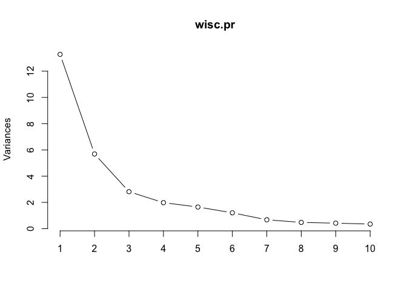
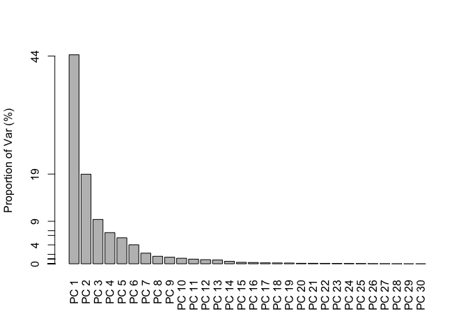
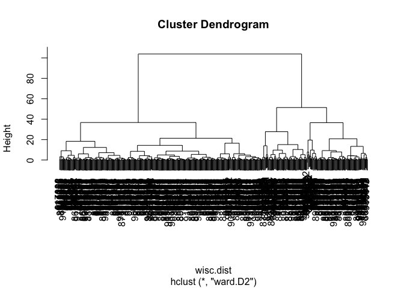
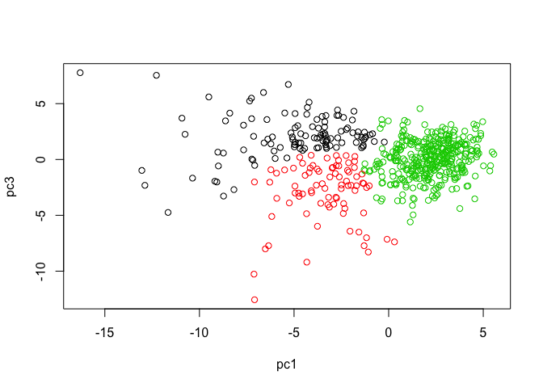
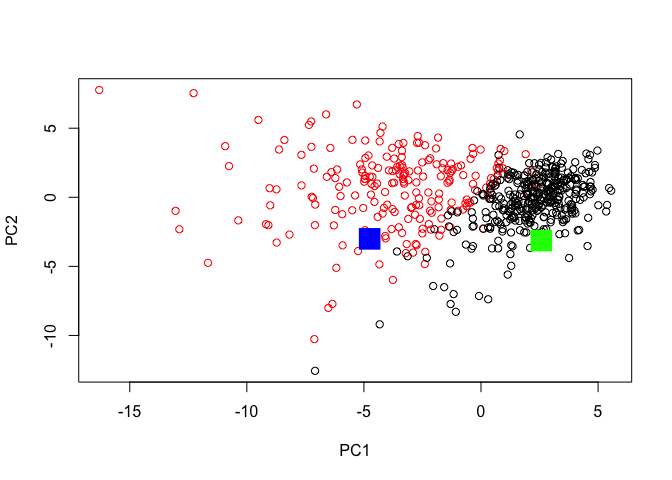

Class 09
================
STEPHANIE CURTIS
02/08/2019

Mini Project
------------

Input Data from Wisconsin Cancer Center

``` r
# Save your input data file to a new 'data' directory
fna.data <- "WisconsinCancer.csv"
wisc.df<-read.csv( fna.data )
```

``` r
head(wisc.df)
```

    ##         id diagnosis radius_mean texture_mean perimeter_mean area_mean
    ## 1   842302         M       17.99        10.38         122.80    1001.0
    ## 2   842517         M       20.57        17.77         132.90    1326.0
    ## 3 84300903         M       19.69        21.25         130.00    1203.0
    ## 4 84348301         M       11.42        20.38          77.58     386.1
    ## 5 84358402         M       20.29        14.34         135.10    1297.0
    ## 6   843786         M       12.45        15.70          82.57     477.1
    ##   smoothness_mean compactness_mean concavity_mean concave.points_mean
    ## 1         0.11840          0.27760         0.3001             0.14710
    ## 2         0.08474          0.07864         0.0869             0.07017
    ## 3         0.10960          0.15990         0.1974             0.12790
    ## 4         0.14250          0.28390         0.2414             0.10520
    ## 5         0.10030          0.13280         0.1980             0.10430
    ## 6         0.12780          0.17000         0.1578             0.08089
    ##   symmetry_mean fractal_dimension_mean radius_se texture_se perimeter_se
    ## 1        0.2419                0.07871    1.0950     0.9053        8.589
    ## 2        0.1812                0.05667    0.5435     0.7339        3.398
    ## 3        0.2069                0.05999    0.7456     0.7869        4.585
    ## 4        0.2597                0.09744    0.4956     1.1560        3.445
    ## 5        0.1809                0.05883    0.7572     0.7813        5.438
    ## 6        0.2087                0.07613    0.3345     0.8902        2.217
    ##   area_se smoothness_se compactness_se concavity_se concave.points_se
    ## 1  153.40      0.006399        0.04904      0.05373           0.01587
    ## 2   74.08      0.005225        0.01308      0.01860           0.01340
    ## 3   94.03      0.006150        0.04006      0.03832           0.02058
    ## 4   27.23      0.009110        0.07458      0.05661           0.01867
    ## 5   94.44      0.011490        0.02461      0.05688           0.01885
    ## 6   27.19      0.007510        0.03345      0.03672           0.01137
    ##   symmetry_se fractal_dimension_se radius_worst texture_worst
    ## 1     0.03003             0.006193        25.38         17.33
    ## 2     0.01389             0.003532        24.99         23.41
    ## 3     0.02250             0.004571        23.57         25.53
    ## 4     0.05963             0.009208        14.91         26.50
    ## 5     0.01756             0.005115        22.54         16.67
    ## 6     0.02165             0.005082        15.47         23.75
    ##   perimeter_worst area_worst smoothness_worst compactness_worst
    ## 1          184.60     2019.0           0.1622            0.6656
    ## 2          158.80     1956.0           0.1238            0.1866
    ## 3          152.50     1709.0           0.1444            0.4245
    ## 4           98.87      567.7           0.2098            0.8663
    ## 5          152.20     1575.0           0.1374            0.2050
    ## 6          103.40      741.6           0.1791            0.5249
    ##   concavity_worst concave.points_worst symmetry_worst
    ## 1          0.7119               0.2654         0.4601
    ## 2          0.2416               0.1860         0.2750
    ## 3          0.4504               0.2430         0.3613
    ## 4          0.6869               0.2575         0.6638
    ## 5          0.4000               0.1625         0.2364
    ## 6          0.5355               0.1741         0.3985
    ##   fractal_dimension_worst  X
    ## 1                 0.11890 NA
    ## 2                 0.08902 NA
    ## 3                 0.08758 NA
    ## 4                 0.17300 NA
    ## 5                 0.07678 NA
    ## 6                 0.12440 NA

``` r
#View(wisc.df)
```

Looks like theres is a funny last col. X" Let's check how many patients there are. (one sample per patient, aka rows) and how many features there is a information for (cols)

``` r
nrow(wisc.df) #number of patients
```

    ## [1] 569

``` r
#number of featers 
ncol(wisc.df)
```

    ## [1] 33

remove some columns:

``` r
wisc.data<-wisc.df[,3:32]
head(wisc.data)
```

    ##   radius_mean texture_mean perimeter_mean area_mean smoothness_mean
    ## 1       17.99        10.38         122.80    1001.0         0.11840
    ## 2       20.57        17.77         132.90    1326.0         0.08474
    ## 3       19.69        21.25         130.00    1203.0         0.10960
    ## 4       11.42        20.38          77.58     386.1         0.14250
    ## 5       20.29        14.34         135.10    1297.0         0.10030
    ## 6       12.45        15.70          82.57     477.1         0.12780
    ##   compactness_mean concavity_mean concave.points_mean symmetry_mean
    ## 1          0.27760         0.3001             0.14710        0.2419
    ## 2          0.07864         0.0869             0.07017        0.1812
    ## 3          0.15990         0.1974             0.12790        0.2069
    ## 4          0.28390         0.2414             0.10520        0.2597
    ## 5          0.13280         0.1980             0.10430        0.1809
    ## 6          0.17000         0.1578             0.08089        0.2087
    ##   fractal_dimension_mean radius_se texture_se perimeter_se area_se
    ## 1                0.07871    1.0950     0.9053        8.589  153.40
    ## 2                0.05667    0.5435     0.7339        3.398   74.08
    ## 3                0.05999    0.7456     0.7869        4.585   94.03
    ## 4                0.09744    0.4956     1.1560        3.445   27.23
    ## 5                0.05883    0.7572     0.7813        5.438   94.44
    ## 6                0.07613    0.3345     0.8902        2.217   27.19
    ##   smoothness_se compactness_se concavity_se concave.points_se symmetry_se
    ## 1      0.006399        0.04904      0.05373           0.01587     0.03003
    ## 2      0.005225        0.01308      0.01860           0.01340     0.01389
    ## 3      0.006150        0.04006      0.03832           0.02058     0.02250
    ## 4      0.009110        0.07458      0.05661           0.01867     0.05963
    ## 5      0.011490        0.02461      0.05688           0.01885     0.01756
    ## 6      0.007510        0.03345      0.03672           0.01137     0.02165
    ##   fractal_dimension_se radius_worst texture_worst perimeter_worst
    ## 1             0.006193        25.38         17.33          184.60
    ## 2             0.003532        24.99         23.41          158.80
    ## 3             0.004571        23.57         25.53          152.50
    ## 4             0.009208        14.91         26.50           98.87
    ## 5             0.005115        22.54         16.67          152.20
    ## 6             0.005082        15.47         23.75          103.40
    ##   area_worst smoothness_worst compactness_worst concavity_worst
    ## 1     2019.0           0.1622            0.6656          0.7119
    ## 2     1956.0           0.1238            0.1866          0.2416
    ## 3     1709.0           0.1444            0.4245          0.4504
    ## 4      567.7           0.2098            0.8663          0.6869
    ## 5     1575.0           0.1374            0.2050          0.4000
    ## 6      741.6           0.1791            0.5249          0.5355
    ##   concave.points_worst symmetry_worst fractal_dimension_worst
    ## 1               0.2654         0.4601                 0.11890
    ## 2               0.1860         0.2750                 0.08902
    ## 3               0.2430         0.3613                 0.08758
    ## 4               0.2575         0.6638                 0.17300
    ## 5               0.1625         0.2364                 0.07678
    ## 6               0.1741         0.3985                 0.12440

We removed the first two rows (patient id and diagnosis removed, and last column X). Now lets set the row names back to the patient id's though!

``` r
rownames(wisc.data)<-wisc.df$id
head(wisc.data)
```

    ##          radius_mean texture_mean perimeter_mean area_mean smoothness_mean
    ## 842302         17.99        10.38         122.80    1001.0         0.11840
    ## 842517         20.57        17.77         132.90    1326.0         0.08474
    ## 84300903       19.69        21.25         130.00    1203.0         0.10960
    ## 84348301       11.42        20.38          77.58     386.1         0.14250
    ## 84358402       20.29        14.34         135.10    1297.0         0.10030
    ## 843786         12.45        15.70          82.57     477.1         0.12780
    ##          compactness_mean concavity_mean concave.points_mean symmetry_mean
    ## 842302            0.27760         0.3001             0.14710        0.2419
    ## 842517            0.07864         0.0869             0.07017        0.1812
    ## 84300903          0.15990         0.1974             0.12790        0.2069
    ## 84348301          0.28390         0.2414             0.10520        0.2597
    ## 84358402          0.13280         0.1980             0.10430        0.1809
    ## 843786            0.17000         0.1578             0.08089        0.2087
    ##          fractal_dimension_mean radius_se texture_se perimeter_se area_se
    ## 842302                  0.07871    1.0950     0.9053        8.589  153.40
    ## 842517                  0.05667    0.5435     0.7339        3.398   74.08
    ## 84300903                0.05999    0.7456     0.7869        4.585   94.03
    ## 84348301                0.09744    0.4956     1.1560        3.445   27.23
    ## 84358402                0.05883    0.7572     0.7813        5.438   94.44
    ## 843786                  0.07613    0.3345     0.8902        2.217   27.19
    ##          smoothness_se compactness_se concavity_se concave.points_se
    ## 842302        0.006399        0.04904      0.05373           0.01587
    ## 842517        0.005225        0.01308      0.01860           0.01340
    ## 84300903      0.006150        0.04006      0.03832           0.02058
    ## 84348301      0.009110        0.07458      0.05661           0.01867
    ## 84358402      0.011490        0.02461      0.05688           0.01885
    ## 843786        0.007510        0.03345      0.03672           0.01137
    ##          symmetry_se fractal_dimension_se radius_worst texture_worst
    ## 842302       0.03003             0.006193        25.38         17.33
    ## 842517       0.01389             0.003532        24.99         23.41
    ## 84300903     0.02250             0.004571        23.57         25.53
    ## 84348301     0.05963             0.009208        14.91         26.50
    ## 84358402     0.01756             0.005115        22.54         16.67
    ## 843786       0.02165             0.005082        15.47         23.75
    ##          perimeter_worst area_worst smoothness_worst compactness_worst
    ## 842302            184.60     2019.0           0.1622            0.6656
    ## 842517            158.80     1956.0           0.1238            0.1866
    ## 84300903          152.50     1709.0           0.1444            0.4245
    ## 84348301           98.87      567.7           0.2098            0.8663
    ## 84358402          152.20     1575.0           0.1374            0.2050
    ## 843786            103.40      741.6           0.1791            0.5249
    ##          concavity_worst concave.points_worst symmetry_worst
    ## 842302            0.7119               0.2654         0.4601
    ## 842517            0.2416               0.1860         0.2750
    ## 84300903          0.4504               0.2430         0.3613
    ## 84348301          0.6869               0.2575         0.6638
    ## 84358402          0.4000               0.1625         0.2364
    ## 843786            0.5355               0.1741         0.3985
    ##          fractal_dimension_worst
    ## 842302                   0.11890
    ## 842517                   0.08902
    ## 84300903                 0.08758
    ## 84348301                 0.17300
    ## 84358402                 0.07678
    ## 843786                   0.12440

how many were benign or malignant

``` r
wiscdiag<-table(wisc.df$diagnosis)
wiscdiag
```

    ## 
    ##   B   M 
    ## 357 212

``` r
wiscfeatures<-colnames(wisc.data)
wiscfeatures
```

    ##  [1] "radius_mean"             "texture_mean"           
    ##  [3] "perimeter_mean"          "area_mean"              
    ##  [5] "smoothness_mean"         "compactness_mean"       
    ##  [7] "concavity_mean"          "concave.points_mean"    
    ##  [9] "symmetry_mean"           "fractal_dimension_mean" 
    ## [11] "radius_se"               "texture_se"             
    ## [13] "perimeter_se"            "area_se"                
    ## [15] "smoothness_se"           "compactness_se"         
    ## [17] "concavity_se"            "concave.points_se"      
    ## [19] "symmetry_se"             "fractal_dimension_se"   
    ## [21] "radius_worst"            "texture_worst"          
    ## [23] "perimeter_worst"         "area_worst"             
    ## [25] "smoothness_worst"        "compactness_worst"      
    ## [27] "concavity_worst"         "concave.points_worst"   
    ## [29] "symmetry_worst"          "fractal_dimension_worst"

How many of my features are means? (aka how many of my column names contain the word "mean"). Using grep function.

``` r
wisc.meanfeats<-grep("mean",wiscfeatures)
wisc.meanfeats #shows you the indices of the column names that contain "mean"
```

    ##  [1]  1  2  3  4  5  6  7  8  9 10

``` r
length(wisc.meanfeats) #tells me how many there are
```

    ## [1] 10

``` r
colnames(wisc.data[wisc.meanfeats])
```

    ##  [1] "radius_mean"            "texture_mean"          
    ##  [3] "perimeter_mean"         "area_mean"             
    ##  [5] "smoothness_mean"        "compactness_mean"      
    ##  [7] "concavity_mean"         "concave.points_mean"   
    ##  [9] "symmetry_mean"          "fractal_dimension_mean"

``` r
round(apply(wisc.data, 2, mean),2) #the first 2 is an argument to the apply function. It means for the apply function to apply to COLUMNS. A 1 there would indicate rows. As it is, this apply fxn is going to give us the mean value for each column. I put the apply function inside a round function with a second 2 for 2 significant figures.
```

    ##             radius_mean            texture_mean          perimeter_mean 
    ##                   14.13                   19.29                   91.97 
    ##               area_mean         smoothness_mean        compactness_mean 
    ##                  654.89                    0.10                    0.10 
    ##          concavity_mean     concave.points_mean           symmetry_mean 
    ##                    0.09                    0.05                    0.18 
    ##  fractal_dimension_mean               radius_se              texture_se 
    ##                    0.06                    0.41                    1.22 
    ##            perimeter_se                 area_se           smoothness_se 
    ##                    2.87                   40.34                    0.01 
    ##          compactness_se            concavity_se       concave.points_se 
    ##                    0.03                    0.03                    0.01 
    ##             symmetry_se    fractal_dimension_se            radius_worst 
    ##                    0.02                    0.00                   16.27 
    ##           texture_worst         perimeter_worst              area_worst 
    ##                   25.68                  107.26                  880.58 
    ##        smoothness_worst       compactness_worst         concavity_worst 
    ##                    0.13                    0.25                    0.27 
    ##    concave.points_worst          symmetry_worst fractal_dimension_worst 
    ##                    0.11                    0.29                    0.08

PCA TIME!
---------

You want to scale your data or else the axes of your PCA's will be wonky. Basically you want every feature/axis to be appropriately scaled to represent the relative positions of each data point along each axis. If feature 1 ranges from 1-10 and feature 2 ranges from 600-2000 then you will be able to see differences along feature 2 on a plot easily but it will basically look like feature 1 is not different at all between all points if feature 1 and two are on the same scale even though a 3 and a 9 on this scale would be huge differences on a 1-10 scale!!

``` r
#prcomp(x,scale=T)
wisc.pr<-prcomp(wisc.data, scale=T)
summary(wisc.pr)
```

    ## Importance of components:
    ##                           PC1    PC2     PC3     PC4     PC5     PC6
    ## Standard deviation     3.6444 2.3857 1.67867 1.40735 1.28403 1.09880
    ## Proportion of Variance 0.4427 0.1897 0.09393 0.06602 0.05496 0.04025
    ## Cumulative Proportion  0.4427 0.6324 0.72636 0.79239 0.84734 0.88759
    ##                            PC7     PC8    PC9    PC10   PC11    PC12
    ## Standard deviation     0.82172 0.69037 0.6457 0.59219 0.5421 0.51104
    ## Proportion of Variance 0.02251 0.01589 0.0139 0.01169 0.0098 0.00871
    ## Cumulative Proportion  0.91010 0.92598 0.9399 0.95157 0.9614 0.97007
    ##                           PC13    PC14    PC15    PC16    PC17    PC18
    ## Standard deviation     0.49128 0.39624 0.30681 0.28260 0.24372 0.22939
    ## Proportion of Variance 0.00805 0.00523 0.00314 0.00266 0.00198 0.00175
    ## Cumulative Proportion  0.97812 0.98335 0.98649 0.98915 0.99113 0.99288
    ##                           PC19    PC20   PC21    PC22    PC23   PC24
    ## Standard deviation     0.22244 0.17652 0.1731 0.16565 0.15602 0.1344
    ## Proportion of Variance 0.00165 0.00104 0.0010 0.00091 0.00081 0.0006
    ## Cumulative Proportion  0.99453 0.99557 0.9966 0.99749 0.99830 0.9989
    ##                           PC25    PC26    PC27    PC28    PC29    PC30
    ## Standard deviation     0.12442 0.09043 0.08307 0.03987 0.02736 0.01153
    ## Proportion of Variance 0.00052 0.00027 0.00023 0.00005 0.00002 0.00000
    ## Cumulative Proportion  0.99942 0.99969 0.99992 0.99997 1.00000 1.00000

Look at proportion of variance (can check cumulative proportion too as the proportion of variances are added) for an idea of the scree plot! The elbow. What components contributes the the bulk of your variance/aka your main slope down a cliff before you hit the rubble at the bottom. 44% and 19% and 10% are big chunks of contributions. But after that, PC5 and 6 and so on are contributing 5% or less.

``` r
#Visualizing scree, wait just kidding we will do tha later.. this plot doesnt take proportion of variance into account maybe? look ahead for actual cscree code
plot(wisc.pr, typ="l")
```



We need to make our own plot of our PCA results because standard plot functions will give you ridiculous/uselessness, like the first plot below!

``` r
#USELESSPLOT: 
biplot(wisc.pr)
```


``` r
#better plot that we can actually use: The color (col) is set to the diagnosis column of the data frame which contains one of two possible characters, either M or B for Malignant or Benign.
plot(wisc.pr$x[,1],wisc.pr$x[,2],col=wisc.df$diagnosis)
```


``` r
#AND LOOK WOW THE CANCEROUS AND NONCANCEROUS PATIENTS SEPARATE INTO DISTINCT POSITIONS
```

Make a scree for our pca results
================================

this plot will show the porportiono f var captuerd in each PC. Basicaly this is the second row of each of the PC infor from summary wisc.pr function above but we just calculated it by ourselves and multiplied it by 100 to get percentages

``` r
variance<-wisc.pr$sdev^2
pve<-round(variance/sum(variance)*100,2)
pve
```

    ##  [1] 44.27 18.97  9.39  6.60  5.50  4.02  2.25  1.59  1.39  1.17  0.98
    ## [12]  0.87  0.80  0.52  0.31  0.27  0.20  0.18  0.16  0.10  0.10  0.09
    ## [23]  0.08  0.06  0.05  0.03  0.02  0.01  0.00  0.00

``` r
plot(pve,type="o")
```


``` r
barplot(pve,axes=FALSE, names.arg=paste("PC",1:length(pve)), las=2, ylab="Proportion of Var (%)")
#names.arg puts a name below each bar-labels weach bar. The paste function pastes strings. #las for rotating the labels in the direction of the bars the sep="sdc" argument to 
axis(2,round(pve)) #puts the axis on side #2 (ther are four sides lol)
```



CLUSTERING IN PRINCIPAL COMPONENT SPACE :)
------------------------------------------

For hclust ew need a distance matrix and we get this from our pca results (the prcomp fnction that we saved as wisc. pr

``` r
wisc.dist<-dist(wisc.pr$x[,1:2])
wisc.hc<-hclust(wisc.dist, method="ward.D2")
plot(wisc.hc) #makes big ole dendrodram
```



``` r
wisc.hc.cut3<-cutree(wisc.hc,k=3) #k cuts it into three groups. or we could do h=40 because we see at that h height that thats a height that would give you 3 gorups
wisc.hc.cut3
```

    ##    842302    842517  84300903  84348301  84358402    843786    844359 
    ##         1         1         1         2         1         2         1 
    ##  84458202    844981  84501001    845636  84610002    846226    846381 
    ##         2         2         2         3         2         1         3 
    ##  84667401  84799002    848406  84862001    849014   8510426   8510653 
    ##         2         2         1         2         1         3         3 
    ##   8510824   8511133    851509    852552    852631    852763    852781 
    ##         3         2         1         1         2         2         1 
    ##    852973    853201    853401    853612  85382601    854002    854039 
    ##         2         1         1         2         2         1         2 
    ##    854253    854268    854941    855133    855138    855167    855563 
    ##         2         3         3         3         3         3         3 
    ##    855625    856106  85638502    857010  85713702     85715    857155 
    ##         1         3         3         1         3         2         3 
    ##    857156    857343    857373    857374    857392    857438  85759902 
    ##         3         3         3         3         1         3         3 
    ##    857637    857793    857810    858477    858970    858981    858986 
    ##         1         2         3         3         3         3         2 
    ##    859196  85922302    859283    859464    859465    859471    859487 
    ##         3         2         2         3         3         2         3 
    ##    859575    859711    859717    859983   8610175   8610404   8610629 
    ##         1         2         2         3         3         1         3 
    ##   8610637   8610862   8610908    861103   8611161   8611555   8611792 
    ##         2         1         3         3         2         1         2 
    ##   8612080   8612399  86135501  86135502    861597    861598    861648 
    ##         3         1         3         1         3         3         3 
    ##    861799    861853    862009    862028     86208     86211    862261 
    ##         3         3         3         2         1         3         3 
    ##    862485    862548    862717    862722    862965    862980    862989 
    ##         3         3         3         3         3         3         3 
    ##    863030    863031    863270     86355    864018    864033     86408 
    ##         2         3         3         1         3         3         3 
    ##     86409    864292    864496    864685    864726    864729    864877 
    ##         2         3         3         3         3         2         2 
    ##    865128    865137     86517    865423    865432    865468     86561 
    ##         1         3         1         1         3         3         3 
    ##    866083    866203    866458    866674    866714      8670  86730502 
    ##         3         1         2         1         3         1         1 
    ##    867387    867739    868202    868223    868682    868826    868871 
    ##         3         1         3         3         3         2         3 
    ##    868999    869104    869218    869224    869254    869476    869691 
    ##         3         1         3         3         3         3         2 
    ##  86973701  86973702    869931 871001501 871001502   8710441     87106 
    ##         3         3         3         3         2         2         3 
    ##   8711002   8711003   8711202   8711216    871122    871149   8711561 
    ##         3         3         2         3         3         3         3 
    ##   8711803    871201   8712064   8712289   8712291     87127   8712729 
    ##         1         1         3         1         3         3         1 
    ##   8712766   8712853  87139402     87163     87164    871641    871642 
    ##         1         3         3         3         2         3         3 
    ##    872113    872608  87281702    873357    873586    873592    873593 
    ##         3         2         2         3         3         1         1 
    ##    873701    873843    873885    874158    874217    874373    874662 
    ##         1         3         3         3         3         3         3 
    ##    874839    874858    875093    875099    875263  87556202    875878 
    ##         3         2         3         3         2         2         3 
    ##    875938    877159    877486    877500    877501    877989    878796 
    ##         2         1         1         3         3         1         1 
    ##     87880     87930    879523    879804    879830   8810158   8810436 
    ##         2         3         3         3         3         3         3 
    ## 881046502   8810528   8810703 881094802   8810955   8810987   8811523 
    ##         1         3         1         2         2         2         3 
    ##   8811779   8811842  88119002   8812816   8812818   8812844   8812877 
    ##         3         1         1         3         3         3         2 
    ##   8813129  88143502  88147101  88147102  88147202    881861    881972 
    ##         3         3         3         3         3         2         2 
    ##  88199202  88203002  88206102    882488  88249602  88299702    883263 
    ##         3         3         1         3         3         1         1 
    ##    883270  88330202  88350402    883539    883852  88411702    884180 
    ##         3         1         3         3         2         3         1 
    ##    884437    884448    884626  88466802    884689    884948  88518501 
    ##         3         3         2         3         3         1         3 
    ##    885429   8860702    886226    886452  88649001    886776    887181 
    ##         1         1         1         3         1         2         1 
    ##  88725602    887549    888264    888570    889403    889719  88995002 
    ##         2         1         3         1         3         1         1 
    ##   8910251   8910499   8910506   8910720   8910721   8910748   8910988 
    ##         3         3         3         3         3         3         1 
    ##   8910996   8911163   8911164   8911230   8911670   8911800   8911834 
    ##         3         3         3         3         3         3         3 
    ##   8912049   8912055     89122   8912280   8912284   8912521   8912909 
    ##         1         3         1         2         3         3         3 
    ##      8913   8913049  89143601  89143602      8915    891670    891703 
    ##         3         3         3         2         3         3         3 
    ##    891716    891923    891936    892189    892214    892399    892438 
    ##         3         3         3         3         3         3         1 
    ##    892604  89263202    892657     89296    893061     89344     89346 
    ##         3         1         3         3         3         3         3 
    ##    893526    893548    893783  89382601  89382602    893988    894047 
    ##         3         3         3         3         3         3         3 
    ##    894089    894090    894326    894329    894335    894604    894618 
    ##         3         3         1         2         3         3         1 
    ##    894855    895100  89511501  89511502     89524    895299   8953902 
    ##         3         1         3         3         3         3         2 
    ##    895633    896839    896864    897132    897137    897374  89742801 
    ##         2         2         3         3         3         3         1 
    ##    897604    897630    897880     89812     89813    898143     89827 
    ##         3         1         3         1         3         3         3 
    ##    898431  89864002    898677    898678     89869    898690    899147 
    ##         1         3         3         3         3         3         3 
    ##    899187    899667    899987   9010018    901011   9010258   9010259 
    ##         3         2         1         2         3         3         3 
    ##    901028   9010333 901034301 901034302    901041   9010598   9010872 
    ##         3         3         3         3         3         3         3 
    ##   9010877    901088   9011494   9011495   9011971   9012000   9012315 
    ##         3         1         1         3         1         1         2 
    ##   9012568   9012795    901288   9013005    901303    901315   9013579 
    ##         3         1         1         3         3         2         3 
    ##   9013594   9013838    901549    901836     90250     90251    902727 
    ##         3         2         3         3         3         3         3 
    ##     90291    902975    902976    903011     90312  90317302    903483 
    ##         3         3         3         3         2         3         3 
    ##    903507    903516    903554    903811  90401601  90401602    904302 
    ##         2         1         3         3         3         3         3 
    ##    904357  90439701    904647    904689      9047    904969    904971 
    ##         3         2         3         3         3         3         3 
    ##    905189    905190  90524101    905501    905502    905520    905539 
    ##         3         3         1         3         3         3         3 
    ##    905557    905680    905686    905978  90602302    906024    906290 
    ##         3         3         3         3         1         3         3 
    ##    906539    906564    906616    906878    907145    907367    907409 
    ##         3         2         3         3         3         3         3 
    ##     90745  90769601  90769602    907914    907915    908194    908445 
    ##         3         3         3         2         3         1         1 
    ##    908469    908489    908916    909220    909231    909410    909411 
    ##         3         3         3         3         3         3         3 
    ##    909445  90944601    909777   9110127   9110720   9110732   9110944 
    ##         1         3         3         1         3         1         3 
    ##    911150 911157302   9111596   9111805   9111843    911201    911202 
    ##         3         1         3         1         3         3         3 
    ##   9112085   9112366   9112367   9112594   9112712 911296201 911296202 
    ##         3         3         3         3         3         1         1 
    ##   9113156 911320501 911320502   9113239   9113455   9113514   9113538 
    ##         3         3         3         2         3         3         2 
    ##    911366   9113778   9113816    911384   9113846    911391    911408 
    ##         3         3         3         3         3         3         3 
    ##    911654    911673    911685    911916    912193     91227    912519 
    ##         3         3         3         2         3         3         3 
    ##    912558    912600    913063    913102    913505    913512    913535 
    ##         3         3         2         3         1         3         3 
    ##  91376701  91376702    914062    914101    914102    914333    914366 
    ##         3         3         1         3         3         3         3 
    ##    914580    914769     91485    914862     91504     91505    915143 
    ##         3         1         1         3         2         3         1 
    ##    915186    915276  91544001  91544002    915452    915460     91550 
    ##         2         2         3         3         3         2         3 
    ##    915664    915691    915940  91594602    916221    916799    916838 
    ##         3         2         3         3         3         1         1 
    ##    917062    917080    917092  91762702     91789    917896    917897 
    ##         3         3         3         1         3         3         3 
    ##     91805  91813701  91813702    918192    918465     91858  91903901 
    ##         3         3         3         3         3         3         3 
    ##  91903902  91930402    919537    919555  91979701    919812    921092 
    ##         3         1         3         1         3         3         3 
    ##    921362    921385    921386    921644    922296    922297    922576 
    ##         3         3         3         3         3         3         3 
    ##    922577    922840    923169    923465    923748    923780    924084 
    ##         3         3         3         3         3         3         3 
    ##    924342    924632    924934    924964    925236    925277    925291 
    ##         3         3         3         3         3         3         3 
    ##    925292    925311    925622    926125    926424    926682    926954 
    ##         3         3         2         1         1         1         1 
    ##    927241     92751 
    ##         1         3

``` r
table(wisc.hc.cut3)
```

    ## wisc.hc.cut3
    ##   1   2   3 
    ## 112  83 374

Plot our PCA

``` r
plot(wisc.pr$x[,1],wisc.pr$x[,2],xlab="pc1",ylab="pc3",col=wisc.hc.cut3)
```

 But now we want to see if this clustering can be compared to the diagnoses that we know! B/M

``` r
diagnosis<-wisc.df$diagnosis=="M"
table(wisc.hc.cut3,diagnosis)
```

    ##             diagnosis
    ## wisc.hc.cut3 FALSE TRUE
    ##            1     0  112
    ##            2    18   65
    ##            3   339   35

``` r
#since M=true its true for cancer false for no cancer. in our first cluster #1 we have 0 noncancers and 112 cancer!!!
```

``` r
#or even better
table(wisc.hc.cut3,wisc.df$diagnosis)
```

    ##             
    ## wisc.hc.cut3   B   M
    ##            1   0 112
    ##            2  18  65
    ##            3 339  35

``` r
new<-read.csv("new_samples.csv")
npc <- predict(wisc.pr, newdata=new)
npc
```

    ##            PC1       PC2        PC3        PC4       PC5        PC6
    ## [1,]  2.576616 -3.135913  1.3990492 -0.7631950  2.781648 -0.8150185
    ## [2,] -4.754928 -3.009033 -0.1660946 -0.6052952 -1.140698 -1.2189945
    ##             PC7        PC8       PC9       PC10      PC11      PC12
    ## [1,] -0.3959098 -0.2307350 0.1029569 -0.9272861 0.3411457  0.375921
    ## [2,]  0.8193031 -0.3307423 0.5281896 -0.4855301 0.7173233 -1.185917
    ##           PC13     PC14      PC15       PC16        PC17        PC18
    ## [1,] 0.1610764 1.187882 0.3216974 -0.1743616 -0.07875393 -0.11207028
    ## [2,] 0.5893856 0.303029 0.1299153  0.1448061 -0.40509706  0.06565549
    ##             PC19       PC20       PC21       PC22       PC23       PC24
    ## [1,] -0.08802955 -0.2495216  0.1228233 0.09358453 0.08347651  0.1223396
    ## [2,]  0.25591230 -0.4289500 -0.1224776 0.01732146 0.06316631 -0.2338618
    ##             PC25         PC26         PC27        PC28         PC29
    ## [1,]  0.02124121  0.078884581  0.220199544 -0.02946023 -0.015620933
    ## [2,] -0.20755948 -0.009833238 -0.001134152  0.09638361  0.002795349
    ##              PC30
    ## [1,]  0.005269029
    ## [2,] -0.019015820

``` r
plot(wisc.pr$x[,1:2], col=wisc.df$diagnosis)
points(npc[,1], npc[,2], col=c("green","blue"), pch=15,cex=3)
```


