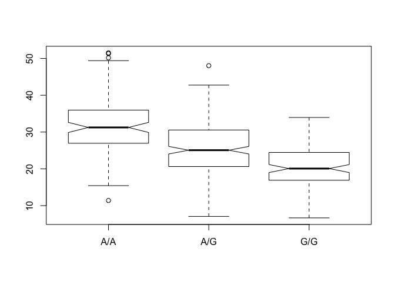

Class 13
================

GitHub Documents
----------------

I downloaded from <http://uswest.ensembl.org/Homo_sapiens/Variation/Sample?db=core;r=17:39894595-39895595;v=rs8067378;vdb=variation;vf=362656008#373531_tablePanel> chose mexican ancestry is los angeles population (MXL)

How many G|G genotypes are there in MXL snps

``` r
mxl<-read.csv("373531-SampleGenotypes-Homo_sapiens_Variation_Sample_rs8067378.csv")
head(mxl)
```

    ##   Sample..Male.Female.Unknown. Genotype..forward.strand. Population.s.
    ## 1                  NA19648 (F)                       A|A ALL, AMR, MXL
    ## 2                  NA19649 (M)                       G|G ALL, AMR, MXL
    ## 3                  NA19651 (F)                       A|A ALL, AMR, MXL
    ## 4                  NA19652 (M)                       G|G ALL, AMR, MXL
    ## 5                  NA19654 (F)                       G|G ALL, AMR, MXL
    ## 6                  NA19655 (M)                       A|G ALL, AMR, MXL
    ##   Father Mother
    ## 1      -      -
    ## 2      -      -
    ## 3      -      -
    ## 4      -      -
    ## 5      -      -
    ## 6      -      -

``` r
numpatientspergenotype<-table(mxl$Genotype..forward.strand.)
numpatientspergenotype
```

    ## 
    ## A|A A|G G|A G|G 
    ##  22  21  12   9

``` r
percentgg<-numpatientspergenotype/nrow(mxl)*100
percentgg
```

    ## 
    ##     A|A     A|G     G|A     G|G 
    ## 34.3750 32.8125 18.7500 14.0625

``` r
library(seqinr)
library(gtools)
chars<-s2c("DDDDCDEDCDDDDBBDDDCC@")
phred <- asc( s2c("DDDDCDEDCDDDDBBDDDCC@") ) - 33
phred
```

    ##  D  D  D  D  C  D  E  D  C  D  D  D  D  B  B  D  D  D  C  C  @ 
    ## 35 35 35 35 34 35 36 35 34 35 35 35 35 33 33 35 35 35 34 34 31

``` r
## D D D D C D E D C D D D D B B D D D C C @
## 35 35 35 35 34 35 36 35 34 35 35 35 35 33 33 35 35 35 34 34 31
prob <- 10**(-phred/10)
```

Genotype-based expression levels
--------------------------------

Took expression data

``` r
expr<-read.table("rs8067378_ENSG00000172057.6.txt")
head(expr)
```

    ##    sample geno      exp
    ## 1 HG00367  A/G 28.96038
    ## 2 NA20768  A/G 20.24449
    ## 3 HG00361  A/A 31.32628
    ## 4 HG00135  A/A 34.11169
    ## 5 NA18870  G/G 18.25141
    ## 6 NA11993  A/A 32.89721

``` r
table(expr$geno)
```

    ## 
    ## A/A A/G G/G 
    ## 108 233 121

``` r
myggs<-which(expr$geno=="G/G")
myggs
```

    ##   [1]   5   9  17  20  23  28  29  31  32  35  41  46  47  49  50  56  57
    ##  [18]  61  72  73  77  79  85  89  92  93 104 105 106 109 110 111 114 115
    ##  [35] 117 118 119 128 132 135 140 143 150 153 156 159 163 166 170 171 172
    ##  [52] 175 178 190 193 194 195 199 201 207 211 218 224 225 232 233 239 241
    ##  [69] 247 250 253 254 259 261 267 268 271 272 280 283 285 287 288 292 293
    ##  [86] 299 307 308 314 316 319 330 340 344 351 355 356 357 361 362 364 369
    ## [103] 373 375 376 378 379 380 381 383 385 391 393 421 428 435 436 446 454
    ## [120] 457 458

``` r
expr[myggs,]
```

    ##      sample geno      exp
    ## 5   NA18870  G/G 18.25141
    ## 9   HG00327  G/G 17.67473
    ## 17  NA12546  G/G 18.55622
    ## 20  NA18488  G/G 23.10383
    ## 23  NA19214  G/G 30.94554
    ## 28  HG00112  G/G 21.14387
    ## 29  NA20518  G/G 18.39547
    ## 31  NA19119  G/G 12.02809
    ## 32  HG00247  G/G 17.44761
    ## 35  NA20758  G/G 29.82254
    ## 41  NA12249  G/G 23.01983
    ## 46  HG00320  G/G 13.42470
    ## 47  NA11843  G/G 22.65437
    ## 49  NA20588  G/G 11.07445
    ## 50  NA20510  G/G 28.35841
    ## 56  HG00118  G/G 28.79371
    ## 57  NA18520  G/G 27.08956
    ## 61  NA12234  G/G 16.11138
    ## 72  NA19152  G/G 26.61928
    ## 73  NA20761  G/G 30.18323
    ## 77  NA18923  G/G 19.40790
    ## 79  HG00238  G/G 19.52301
    ## 85  NA12058  G/G 26.56808
    ## 89  HG00129  G/G 17.34076
    ## 92  HG00183  G/G 10.74263
    ## 93  HG00109  G/G 16.66051
    ## 104 NA18517  G/G 29.01720
    ## 105 NA20801  G/G 20.69333
    ## 106 NA20529  G/G 21.15677
    ## 109 HG00349  G/G 18.58691
    ## 110 HG00234  G/G 19.04962
    ## 111 NA19248  G/G 22.81974
    ## 114 NA12813  G/G 32.01142
    ## 115 NA20537  G/G 21.12823
    ## 117 HG00332  G/G 18.61268
    ## 118 HG00152  G/G 19.37093
    ## 119 NA20783  G/G 31.42162
    ## 128 HG00185  G/G 16.67764
    ## 132 NA20531  G/G 19.08659
    ## 135 HG00277  G/G 21.55001
    ## 140 HG00336  G/G  8.29591
    ## 143 NA20581  G/G 12.58869
    ## 150 NA20538  G/G 17.34109
    ## 153 NA20814  G/G 28.23642
    ## 156 NA19171  G/G 19.99979
    ## 159 HG00141  G/G 25.55413
    ## 163 NA19190  G/G 24.45672
    ## 166 NA10851  G/G 23.53572
    ## 170 HG00116  G/G 22.48273
    ## 171 NA12272  G/G 14.66862
    ## 172 NA19096  G/G 33.95602
    ## 175 NA19236  G/G 18.26466
    ## 178 HG00345  G/G 16.06661
    ## 190 HG00156  G/G 17.32504
    ## 193 HG00282  G/G 19.14766
    ## 194 HG00343  G/G 12.57599
    ## 195 HG00139  G/G 22.28749
    ## 199 HG00232  G/G 17.29261
    ## 201 HG00122  G/G 24.18141
    ## 207 NA19149  G/G 16.07627
    ## 211 HG00189  G/G 14.80495
    ## 218 HG00126  G/G 23.46573
    ## 224 HG00265  G/G 28.97074
    ## 225 HG00378  G/G 27.78837
    ## 232 NA20796  G/G 23.92355
    ## 233 NA12399  G/G  9.55902
    ## 239 HG00099  G/G 12.35836
    ## 241 NA19114  G/G 22.53910
    ## 247 NA19210  G/G 21.98118
    ## 250 HG00276  G/G 16.40569
    ## 253 HG00181  G/G 25.21931
    ## 254 HG00346  G/G 24.32857
    ## 259 HG00142  G/G 19.42882
    ## 261 HG00315  G/G 26.56993
    ## 267 HG00250  G/G 13.34557
    ## 268 NA20769  G/G 16.60507
    ## 271 NA19144  G/G 24.85165
    ## 272 NA12815  G/G 21.56943
    ## 280 NA19175  G/G 23.95528
    ## 283 NA18519  G/G 16.18962
    ## 285 NA20535  G/G 22.53720
    ## 287 HG00260  G/G 26.04123
    ## 288 HG00372  G/G  6.67482
    ## 292 HG00261  G/G 20.07363
    ## 293 HG00273  G/G 19.76527
    ## 299 HG00358  G/G 18.50772
    ## 307 NA19121  G/G 20.14146
    ## 308 NA20515  G/G 18.07151
    ## 314 NA10847  G/G  6.94390
    ## 316 NA12400  G/G 22.14277
    ## 319 HG00342  G/G 14.23742
    ## 330 HG00136  G/G 19.85388
    ## 340 NA20765  G/G 27.73467
    ## 344 NA18502  G/G 19.02064
    ## 351 NA20772  G/G 14.49816
    ## 355 HG00257  G/G 26.78940
    ## 356 NA18486  G/G 20.84709
    ## 357 HG00188  G/G 10.77316
    ## 361 HG00280  G/G 12.82128
    ## 362 HG00308  G/G 16.90256
    ## 364 NA18910  G/G 29.60045
    ## 369 HG00281  G/G 14.81945
    ## 373 NA12275  G/G 17.46326
    ## 375 HG00351  G/G 23.26922
    ## 376 HG00186  G/G 21.39806
    ## 378 HG00275  G/G 18.06320
    ## 379 HG00325  G/G 15.91528
    ## 380 NA19118  G/G 24.80823
    ## 381 HG00124  G/G 26.04514
    ## 383 HG02215  G/G 18.28089
    ## 385 HG00134  G/G 23.24907
    ## 391 NA11931  G/G 17.91118
    ## 393 HG00120  G/G 21.09502
    ## 421 NA20582  G/G 24.74366
    ## 428 NA12889  G/G 27.40521
    ## 435 NA12006  G/G 24.85772
    ## 436 NA19108  G/G 23.08482
    ## 446 NA07346  G/G 16.56929
    ## 454 HG00154  G/G 16.69044
    ## 457 HG00233  G/G 25.08880
    ## 458 HG00131  G/G 32.78519

``` r
expr.gg<-expr[myggs, "exp"]
summary(expr.gg)
```

    ##    Min. 1st Qu.  Median    Mean 3rd Qu.    Max. 
    ##   6.675  16.903  20.074  20.594  24.457  33.956

``` r
#now for the other genotypes:
myaas<-which(expr$geno=="A/A")
expr[myaas,]
```

    ##      sample geno      exp
    ## 3   HG00361  A/A 31.32628
    ## 4   HG00135  A/A 34.11169
    ## 6   NA11993  A/A 32.89721
    ## 8   NA18498  A/A 47.64556
    ## 13  NA20585  A/A 30.71355
    ## 15  HG00235  A/A 25.44983
    ## 16  NA20798  A/A 34.24915
    ## 18  NA19116  A/A 35.15014
    ## 24  NA19247  A/A 24.54684
    ## 27  NA19207  A/A 49.39612
    ## 30  HG00335  A/A 28.20755
    ## 37  NA20759  A/A 28.56199
    ## 48  HG00105  A/A 51.51787
    ## 53  NA11894  A/A 38.10956
    ## 55  HG00132  A/A 31.13741
    ## 62  HG00377  A/A 39.12999
    ## 67  NA19172  A/A 32.44173
    ## 76  NA20544  A/A 34.03260
    ## 82  NA18868  A/A 36.27151
    ## 96  HG00174  A/A 26.10355
    ## 97  HG00324  A/A 19.48106
    ## 99  NA20520  A/A 38.77623
    ## 102 HG00111  A/A 40.82922
    ## 112 NA20810  A/A 46.50527
    ## 121 HG00236  A/A 33.07320
    ## 122 NA19146  A/A 25.47283
    ## 127 NA11881  A/A 29.50655
    ## 133 NA19138  A/A 27.48438
    ## 154 NA19222  A/A 35.69719
    ## 155 NA06989  A/A 32.42236
    ## 162 NA12749  A/A 28.91526
    ## 167 HG00371  A/A 19.14544
    ## 169 NA12004  A/A 22.85572
    ## 174 HG00102  A/A 31.17067
    ## 177 NA20521  A/A 27.87464
    ## 179 NA20509  A/A 27.91580
    ## 180 HG00329  A/A 16.86780
    ## 182 HG00359  A/A 23.66127
    ## 187 NA11892  A/A 28.03403
    ## 188 NA20804  A/A 36.51922
    ## 198 HG00306  A/A 27.43637
    ## 202 NA07037  A/A 35.63983
    ## 205 NA19129  A/A 38.85161
    ## 214 HG00323  A/A 22.44576
    ## 215 NA18916  A/A 37.06379
    ## 217 HG00100  A/A 35.67637
    ## 226 NA20790  A/A 50.16704
    ## 227 NA20512  A/A 37.94544
    ## 228 HG00268  A/A 29.15536
    ## 229 HG00380  A/A 28.85309
    ## 230 NA12761  A/A 38.57101
    ## 235 HG00096  A/A 30.89365
    ## 240 NA07048  A/A 39.31537
    ## 242 HG00376  A/A 31.43743
    ## 243 NA19092  A/A 35.26739
    ## 245 HG00158  A/A 22.37043
    ## 246 HG00269  A/A 28.46943
    ## 248 HG00258  A/A 30.15636
    ## 257 NA12347  A/A 35.88457
    ## 263 NA11995  A/A 32.59723
    ## 264 NA19209  A/A 36.02549
    ## 265 NA20540  A/A 23.86454
    ## 266 NA12890  A/A 28.38114
    ## 269 HG00138  A/A 25.14243
    ## 270 NA19200  A/A 51.30170
    ## 275 NA12383  A/A 28.14811
    ## 278 NA06984  A/A 29.18390
    ## 290 NA07357  A/A 27.09760
    ## 298 NA11930  A/A 33.89656
    ## 304 NA19131  A/A 33.48253
    ## 305 NA18499  A/A 15.43178
    ## 306 HG00117  A/A 29.45277
    ## 322 HG00160  A/A 26.80283
    ## 332 NA12340  A/A 43.51943
    ## 337 HG00146  A/A 45.80808
    ## 341 HG00362  A/A 26.55972
    ## 343 NA18917  A/A 24.87330
    ## 346 NA20527  A/A 29.99549
    ## 348 NA20805  A/A 26.68589
    ## 354 NA12156  A/A 39.37193
    ## 359 HG00157  A/A 38.39523
    ## 360 HG00262  A/A 41.23635
    ## 368 HG00101  A/A 27.13936
    ## 370 NA20760  A/A 36.55643
    ## 371 HG00176  A/A 28.34688
    ## 374 NA20514  A/A 15.42908
    ## 382 NA20785  A/A 47.50579
    ## 384 HG00253  A/A 30.15754
    ## 386 HG00339  A/A 34.88439
    ## 389 NA18861  A/A 29.29955
    ## 390 NA20539  A/A 32.87767
    ## 400 HG00145  A/A 43.43665
    ## 401 NA19225  A/A 26.56050
    ## 405 HG00379  A/A 21.87746
    ## 408 NA18907  A/A 33.42582
    ## 409 NA19204  A/A 25.38406
    ## 412 NA20770  A/A 18.20442
    ## 420 HG00104  A/A 21.62336
    ## 424 NA20786  A/A 35.80093
    ## 426 NA20756  A/A 32.26844
    ## 433 NA12762  A/A 34.40756
    ## 442 HG00159  A/A 23.99631
    ## 443 NA20811  A/A 11.39643
    ## 448 HG01791  A/A 35.24632
    ## 451 HG00182  A/A 23.38376
    ## 456 NA12750  A/A 34.94395
    ## 459 HG00108  A/A 31.92036
    ## 461 NA19130  A/A 44.27738

``` r
expr.aa<-expr[myaas, "exp"]
summary(expr.aa)
```

    ##    Min. 1st Qu.  Median    Mean 3rd Qu.    Max. 
    ##   11.40   27.02   31.25   31.82   35.92   51.52

``` r
myags<-which(expr$geno=="A/G")
expr[myags,]
```

    ##      sample geno      exp
    ## 1   HG00367  A/G 28.96038
    ## 2   NA20768  A/G 20.24449
    ## 7   HG00256  A/G 31.48736
    ## 10  HG00115  A/G 33.85374
    ## 11  NA20806  A/G 16.29854
    ## 12  HG00278  A/G 19.73450
    ## 14  NA19137  A/G 13.96175
    ## 19  HG00381  A/G 18.40351
    ## 21  HG00259  A/G 34.21985
    ## 22  HG00177  A/G 23.32404
    ## 25  NA19098  A/G 23.18606
    ## 26  NA20589  A/G 18.15997
    ## 33  NA12155  A/G 28.03580
    ## 34  NA20771  A/G 30.65270
    ## 36  HG00121  A/G 20.51327
    ## 38  NA20816  A/G 29.72309
    ## 39  NA20542  A/G 22.50789
    ## 40  NA18511  A/G 31.68959
    ## 42  NA11830  A/G 28.76435
    ## 43  NA19159  A/G 35.85543
    ## 44  NA20778  A/G 37.62403
    ## 45  NA18908  A/G 20.54885
    ## 51  NA12342  A/G 31.04941
    ## 52  HG00249  A/G 18.94583
    ## 54  HG00240  A/G 32.29483
    ## 58  NA18508  A/G 27.81775
    ## 59  HG00353  A/G 19.89903
    ## 60  NA20792  A/G 48.03410
    ## 63  NA19143  A/G 27.90313
    ## 64  NA20787  A/G 36.47949
    ## 65  NA20513  A/G 20.03116
    ## 66  HG00243  A/G 29.65063
    ## 68  NA06994  A/G 34.92257
    ## 69  NA18510  A/G 16.71385
    ## 70  HG00337  A/G 16.68151
    ## 71  NA20503  A/G 25.71008
    ## 74  NA19235  A/G 11.60808
    ## 75  HG00382  A/G 19.30953
    ## 78  HG00313  A/G 20.49040
    ## 80  NA20754  A/G 22.37224
    ## 81  NA11918  A/G 15.20045
    ## 83  NA06986  A/G 20.07459
    ## 84  HG00263  A/G 35.42982
    ## 86  NA20507  A/G 19.10884
    ## 87  NA12777  A/G 24.81087
    ## 88  NA12144  A/G 33.22193
    ## 90  HG00123  A/G 33.40835
    ## 91  NA12814  A/G 22.38996
    ## 94  NA20505  A/G 31.31626
    ## 95  NA12273  A/G  9.36055
    ## 98  HG00365  A/G 23.17937
    ## 100 NA19189  A/G 30.63079
    ## 101 HG00155  A/G 19.10420
    ## 103 NA12827  A/G 25.70962
    ## 107 NA18909  A/G 38.34531
    ## 108 HG00173  A/G 19.03976
    ## 113 HG00255  A/G 28.81770
    ## 116 NA18912  A/G 42.75662
    ## 120 NA12154  A/G 25.61662
    ## 123 HG00312  A/G 26.48467
    ## 124 HG00148  A/G 28.02486
    ## 125 HG00364  A/G 24.23377
    ## 126 HG00311  A/G 21.03717
    ## 129 NA20807  A/G 33.51752
    ## 130 NA19184  A/G 20.73493
    ## 131 HG00133  A/G 33.55650
    ## 134 NA19206  A/G 36.62034
    ## 136 NA18858  A/G 40.06318
    ## 137 HG00375  A/G 33.92744
    ## 138 HG00127  A/G 21.02084
    ## 139 NA19099  A/G 29.95687
    ## 141 HG00097  A/G 25.80393
    ## 142 HG00267  A/G 21.49924
    ## 144 NA12286  A/G 34.79575
    ## 145 NA20797  A/G 34.57705
    ## 146 NA12872  A/G 30.03549
    ## 147 HG00360  A/G 16.59638
    ## 148 NA20530  A/G 27.22300
    ## 149 NA12348  A/G 24.35621
    ## 151 NA12760  A/G 22.86793
    ## 152 NA12763  A/G 23.19511
    ## 157 NA11829  A/G 33.74015
    ## 158 NA11992  A/G 24.08401
    ## 160 NA19150  A/G 26.39419
    ## 161 NA20828  A/G 32.33359
    ## 164 NA06985  A/G 11.36287
    ## 165 HG00178  A/G 21.16515
    ## 168 NA20541  A/G 17.21277
    ## 173 NA20800  A/G 22.73049
    ## 176 HG00264  A/G 25.57669
    ## 181 NA12830  A/G 11.97590
    ## 183 NA07051  A/G 25.35846
    ## 184 NA20516  A/G 33.32411
    ## 185 HG00128  A/G 22.09122
    ## 186 NA20534  A/G 25.19977
    ## 189 NA11994  A/G 30.83577
    ## 191 NA12843  A/G 23.63709
    ## 192 HG00180  A/G 19.66773
    ## 196 HG01789  A/G 24.64870
    ## 197 HG00321  A/G 17.03159
    ## 200 NA20528  A/G 22.27101
    ## 203 NA07056  A/G 15.92557
    ## 204 HG00151  A/G 32.54150
    ## 206 NA20517  A/G 22.40203
    ## 208 HG00341  A/G 27.41638
    ## 209 HG00274  A/G 31.99645
    ## 210 HG00106  A/G 30.05415
    ## 212 HG00252  A/G 20.01602
    ## 213 NA11832  A/G 34.47373
    ## 216 NA18867  A/G 28.75978
    ## 219 NA20813  A/G 29.91249
    ## 220 NA20504  A/G 15.71646
    ## 221 NA20532  A/G 21.76610
    ## 222 NA12812  A/G  9.62656
    ## 223 HG00244  A/G 28.53965
    ## 231 HG00384  A/G 29.49417
    ## 234 HG00310  A/G 29.55520
    ## 236 NA19147  A/G 19.44178
    ## 237 NA20752  A/G 21.43751
    ## 238 NA19107  A/G 30.40382
    ## 244 HG00130  A/G 28.50982
    ## 249 NA19256  A/G 21.48847
    ## 251 HG00331  A/G 31.10134
    ## 252 NA12751  A/G 35.99067
    ## 255 NA11920  A/G 26.42877
    ## 256 HG00326  A/G 26.28329
    ## 258 NA12716  A/G 20.72639
    ## 260 HG00309  A/G 21.09140
    ## 262 HG00338  A/G 23.79292
    ## 273 NA12043  A/G 18.79569
    ## 274 HG00350  A/G 29.54042
    ## 276 NA19201  A/G 18.78700
    ## 277 HG00187  A/G 21.41071
    ## 279 NA20508  A/G 21.29782
    ## 281 NA20815  A/G 33.91853
    ## 282 NA12044  A/G 27.20808
    ## 284 NA20799  A/G 17.14895
    ## 286 NA19141  A/G 28.72738
    ## 289 NA07347  A/G 37.73840
    ## 291 NA20543  A/G 34.14567
    ## 294 NA12341  A/G 15.36874
    ## 295 HG00245  A/G 29.50350
    ## 296 NA19198  A/G 25.70400
    ## 297 NA20757  A/G 20.07219
    ## 300 NA18933  A/G 24.53928
    ## 301 HG00242  A/G 17.84487
    ## 302 NA20773  A/G 23.35766
    ## 303 NA12282  A/G 15.71243
    ## 309 HG00355  A/G 19.89034
    ## 310 NA12775  A/G 25.37234
    ## 311 NA12005  A/G 16.12745
    ## 312 NA11893  A/G 24.18529
    ## 313 NA20808  A/G 21.97051
    ## 315 NA19102  A/G 13.08172
    ## 317 NA18487  A/G 32.00764
    ## 318 NA19093  A/G 30.59653
    ## 320 NA19160  A/G 29.74443
    ## 321 NA19095  A/G 27.88354
    ## 323 NA20766  A/G 11.12451
    ## 324 NA12717  A/G  7.07505
    ## 325 HG00125  A/G 23.13726
    ## 326 HG00171  A/G 21.09331
    ## 327 NA12873  A/G  8.20002
    ## 328 NA20525  A/G 20.62572
    ## 329 NA20826  A/G 18.24345
    ## 331 HG00272  A/G 11.13478
    ## 333 HG00251  A/G 24.43943
    ## 334 HG00369  A/G 22.24289
    ## 335 NA20803  A/G 24.67325
    ## 336 NA12842  A/G 41.03924
    ## 338 HG01790  A/G 33.31795
    ## 339 NA20809  A/G 27.98844
    ## 342 HG00114  A/G 31.57994
    ## 345 HG00150  A/G 36.73337
    ## 347 HG00179  A/G 18.45322
    ## 349 NA19117  A/G 23.60431
    ## 350 HG00285  A/G 24.33489
    ## 352 NA19213  A/G 35.74662
    ## 353 HG00344  A/G 22.75684
    ## 358 HG00366  A/G 34.42403
    ## 363 NA11831  A/G 25.34866
    ## 365 NA20795  A/G 25.06486
    ## 366 HG00231  A/G 36.78028
    ## 367 NA19197  A/G 30.67131
    ## 372 NA18489  A/G 37.82860
    ## 377 NA20586  A/G 25.44086
    ## 387 NA20519  A/G 29.49548
    ## 388 NA12778  A/G 23.27255
    ## 392 NA20812  A/G 28.69506
    ## 394 HG00103  A/G 26.52036
    ## 395 HG00328  A/G 27.49975
    ## 396 NA20774  A/G 24.66196
    ## 397 NA18873  A/G 25.81562
    ## 398 NA20502  A/G 22.49429
    ## 399 HG00143  A/G 26.88264
    ## 402 NA12829  A/G 28.98200
    ## 403 HG00137  A/G 34.31875
    ## 404 NA20524  A/G 26.40231
    ## 406 NA18505  A/G 21.67621
    ## 407 HG01334  A/G 27.56805
    ## 410 NA12874  A/G 16.16277
    ## 411 NA20506  A/G 18.28963
    ## 413 NA12776  A/G 30.55183
    ## 414 NA18934  A/G 20.70871
    ## 415 NA19153  A/G 17.66476
    ## 416 HG00356  A/G 22.79543
    ## 417 NA12283  A/G 24.03419
    ## 418 HG00284  A/G 18.02351
    ## 419 NA12489  A/G 21.63102
    ## 422 NA11840  A/G 27.54976
    ## 423 HG00383  A/G 14.79717
    ## 425 NA20802  A/G 25.34921
    ## 427 NA19113  A/G 21.34916
    ## 429 NA12718  A/G 21.20080
    ## 430 HG00266  A/G 28.36006
    ## 431 NA12287  A/G 22.43773
    ## 432 HG00319  A/G 25.56306
    ## 434 HG00334  A/G 19.50634
    ## 437 NA19185  A/G 28.93651
    ## 438 HG00246  A/G 31.79897
    ## 439 NA12045  A/G 30.80067
    ## 440 NA19257  A/G 33.95134
    ## 441 NA12413  A/G 39.43243
    ## 444 HG00149  A/G 23.91465
    ## 445 NA19223  A/G 20.97560
    ## 447 NA20536  A/G 20.02507
    ## 449 HG00271  A/G 33.44170
    ## 450 HG00373  A/G 17.32813
    ## 452 HG00110  A/G 32.61856
    ## 453 NA20819  A/G 36.77906
    ## 455 HG00330  A/G 16.84776
    ## 460 HG00119  A/G 31.53069
    ## 462 HG00239  A/G 23.18250

``` r
expr.ag<-expr[myags, "exp"]
summary(expr.ag)
```

    ##    Min. 1st Qu.  Median    Mean 3rd Qu.    Max. 
    ##   7.075  20.626  25.065  25.397  30.552  48.034

Let's look at our data using box plots to visualize the values we see with the summary function.

``` r
boxplot(exp ~ geno, data=expr, notch=T)
```



Now a prettier plot with ggplot tools

``` r
# Boxplot with the data shown
library(ggplot2)
ggplot(expr, aes(geno, exp, fill=geno)) + 
  geom_boxplot(notch=TRUE, outlier.shape = NA) + 
  geom_jitter(shape=16, position=position_jitter(0.2), alpha=0.4)
```


