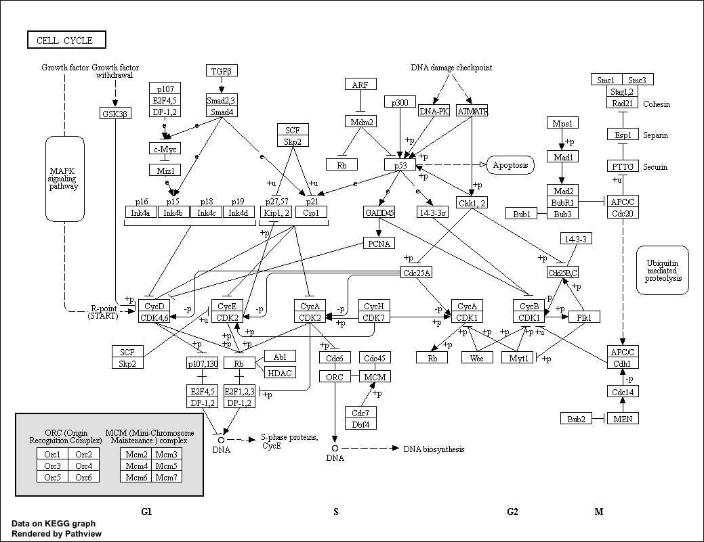

```{r setup, include=FALSE}
knitr::opts_chunk$set(echo = TRUE)
```

## Differential Expression Analysis


To keep the output of **library()** from appearing on your knitted document, select the gear icon of the code chunk and uncheck the "show messages" button. This puts {message=FALSE} at the top of your chunk.
```{r message=FALSE}
library(DESeq2)
```


```{r}
metaFile <- "data/GSE37704_metadata.csv"
countFile <- "data/GSE37704_featurecounts.csv"

# Import metadata and take a peak
colData<-read.csv(metaFile, row.names=1)
head(colData)
```

```{r}
# Import countdata
countData = read.csv(countFile, row.names=1)
head(countData)
```

```{r}
nrow(countData)
dim(countData)

```


count data and meta data need to match so we do this extra step to get rid of the unmatching column in countdata
```{r}
# Note we need to remove the odd first $length col
countData <- as.matrix(countData[,-1])
#could also use countData[,2:7]
head(countData)
```

```{r}
rownames(colData)
colnames(countData)
```

Eliminate the rows that have 0 across all of the columns (No zeros - noz)

```{r}

inds<- rowSums(countData != 0)
countData<-countData[inds,]
dim(countData)
```


In order to paste the number of rows in my columns to the text of my knitted document I can embed a little code outside of a code chunking using backticks:
We now have `r nrow(countData)` genes remaining in our dataset.


#Problem
With the intended next step. Got an error for the program not finding the appropriate variation to call any significant changes. The code was altered as seen below in such a way that it still generated output for me to practice the next steps, but the next steps do no yield exactly the same results as example code. Since no significant fold change was detected, the pathway analysis output is not color-coded by up- and down-regulated genes, for instance.

```{r}
dds = DESeqDataSetFromMatrix(countData=countData,
                             colData=colData,
                             design=~condition)
dds <- estimateDispersionsGeneEst(estimateSizeFactors(dds))
dispersions(dds) <- mcols(dds)$dispGeneEst
res <- results(nbinomWaldTest(dds))
res

```

```{r}
plot(res$log2FoldChange, -log(res$padj))
inds<- (res$padj <0.01) & (abs(res$log2FoldChange))

```


##Adding gene annotation

```{r}
library("AnnotationDbi")
library("org.Hs.eg.db")
#these are the keys
columns(org.Hs.eg.db)

```

```{r}
#Creating a new column called #SYMBOL
res$symbol = mapIds(org.Hs.eg.db,
                    keys= row.names(res),
                    keytype="ENSEMBL",
                    column="SYMBOL",
                    multiVals="first")

```
```{r}
res$entrez = mapIds(org.Hs.eg.db,
                    keys= row.names(res),
                    keytype="ENSEMBL",
                    column="ENTREZID",
                    multiVals="first")

res$name =   mapIds(org.Hs.eg.db,
                    keys=row.names(res),
                    keytype="ENSEMBL",
                    column="GENENAME",
                    multiVals="first")

head(res, 10)
```


```{r}
res<-res[order(res$pvalue),]
write.csv(res, file="deseq_results.csv")
```


#PART TWO

```{r}
library(pathview)
```


```{r}
#gage has kegg and go in it
library(gage)
library(gageData)

data(kegg.sets.hs)
data(sigmet.idx.hs)

```

```{r}
# Focus on signaling and metabolic pathways only
kegg.sets.hs = kegg.sets.hs[sigmet.idx.hs]

# Examine the first 3 pathways.
head(kegg.sets.hs, 3)

#how many genese are in each of hte first three pathway? caffeine metabolism has only 7. Purine metabolism has a lot more
```

set up my input for **gage()**
```{r}
foldchanges = res$log2FoldChange
names(foldchanges) = res$entrez
head(foldchanges)
```
```{r}
keggres<-gage(foldchanges, gsets=kegg.sets.hs)
```

```{r}
attributes(keggres)
```
```{r}
head(keggres$less)
```

```{r}
pathview(gene.data=foldchanges, pathway.id="hsa04110")
```



```{r}
keggrespathways <- rownames(keggres$greater)[1:5]

# Extract the 8 character long IDs part of each string
keggresids = substr(keggrespathways, start=1, stop=8)
keggresids
```

```{r}
pathview(gene.data=foldchanges, pathway.id=keggresids, species="hsa")
```


```{r}
data(go.sets.hs)
data(go.subs.hs)

# Focus on Biological Process subset of GO
gobpsets = go.sets.hs[go.subs.hs$BP]
#the gage() function is being passed a gsets argument equal to the GO database as opposed to the pathway database like it was above...
gobpres = gage(foldchanges, gsets=gobpsets, same.dir=TRUE)

lapply(gobpres, head)
```

```{r}
sig_genes <- res[res$padj <= 0.05 & !is.na(res$padj), "symbol"]
print(paste("Total number of significant genes:", length(sig_genes)))
```

