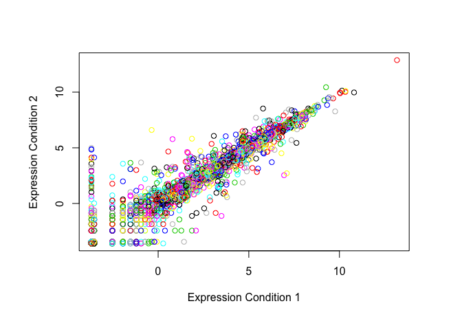

Graphics & Plotting 
================
Stephanie Curtis
01/25/19

Graphics and Plotting in base R
Styling text with **bold** and *italics*.

Create line plot. Specify plot characteristics including line properties, point characters, axis properties, and colors:
``` r
#Sample provided with weight data:
weight<-read.table("bimm143_05_rstats/weight_chart.txt",header=TRUE)
plot(weight,pch=1,sub="Interesting subtitle",cex=1.5,lwd=2,ylim=c(2,10),type="o",col="purple",xlab="Age (months)", ylab="Weight (kg)",main="Baby weight with age")
```


Create bar plot. Specify plot margins.
``` r
#Use sample feature data:
feat<-read.table("bimm143_05_rstats/feature_counts.txt",header=T,sep="\t")
par(mar=c(10,10,4,4))
barplot(feat$Count,names.arg=feat$Feature,las=1,horiz=T,xlab="Counts",main="Counts of features")
```


Create plot without hard-coding color parameters. Set number of colors to number of observations present in sample data:
``` r
mfc<-read.table("bimm143_05_rstats/male_female_counts.txt",header=T,sep="\t")
par(mar=c(6,6,4,4)) 
barplot(mfc$Count,names.arg=mfc$Sample,las=2,col=rainbow(nrow(mfc)))
```


Use **table()** function to summarize data:
``` r
#Load sample gene expression data, pre-annotated with change in expression annotation.
genes<-read.delim("bimm143_05_rstats/up_down_expression.txt")
#Input to table() is a vector containing descriptors of genes with unchanging, increasing, or decreasing expression. Output displays how many observations (genes) fall into each category.
table(genes$State)
```

    ## 
    ##       down unchanging         up 
    ##         72       4997        127

Look at your data color-coded by direction of gene expression change:
``` r
#color will return every observation (gene) in one color from three options. You have defined three options according to the number of qualities that are possible for each observation in the expression change category (unchanging vs increasing vs decreasing)
#saving default color palette is necessary to be able to reset it later
ogpalette <- palette()
palette(c("blue","gray","red"))
plot(genes$Condition1,genes$Condition2,col=genes$State,xlab="Expression Condition 1", ylab="Expression Condition 2")
```


If you did not set color parameters based on a variable applied to each observation, the default color scheme would retrun a plot like this:
``` r
#return to default palette setting:
palette(ogpalette)
#The same number of colors as observations in your data
plot(genes$Condition1,genes$Condition2,col=genes$Gene,xlab="Expression Condition 1", ylab="Expression Condition 2")
```


